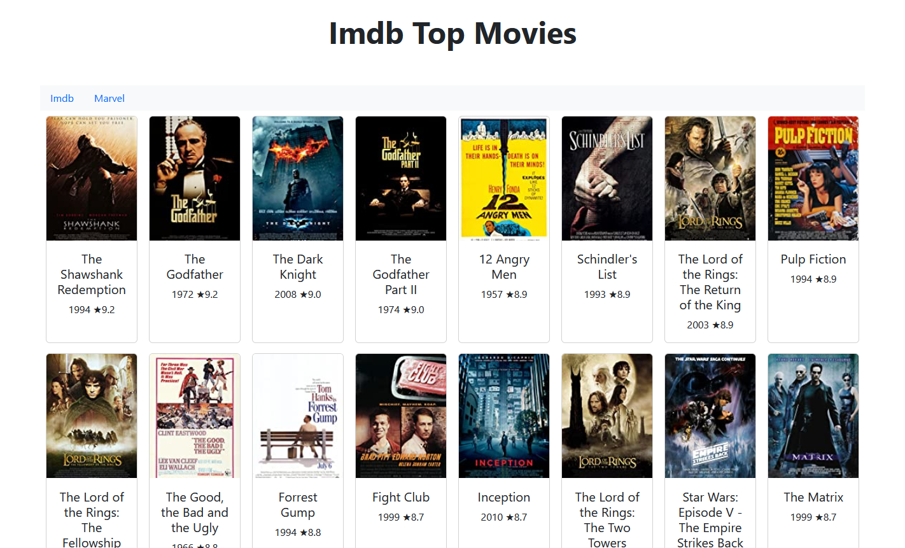

# IMDB Top Movies

Change language to: [Português Brasileiro](./LEIAME.md)

## Table of Contents

* [Description](#description)
* [Technologies](#technologies)
* [Running](#running)

 

## Description

This is part of a [Java 7 days of code challenge](https://7daysofcode.io/matricula/java)

The challenge started as a consumer to IMDB's 250 top movies API. However, using polymorphism, it grew as a consumer of generic content API.

- [x] Day 1: Consume the IMDB API, fetch the top 250 movies from their list and print the corresponding JSON in the console.
- [x] Day 2: Parse the JSON response obtained from IMDB to extract its information and attributes
- [x] Day 3: Model code to encapsulate movie attributes
- [x] Day 4: Create an HTML page where you can see information about the movie, including the poster and rating.
- [x] Day 5: Encapsulate the API call and parsing the JSON into classes.
- [x] Day 6: Make the code more generic, prepared to receive data from other APIs, using polymorphism.
- [ ] Day 7: ???

 

 

## Technologies
            

  
  Java

  
  Spring

      
  HTML

  
  Bootstrap

 

## Running

Before running you need to get an IMDB API Key in [https://imdb-api.com/api](https://imdb-api.com/api) and a Marvel API Key in [https://developer.marvel.com/] (https://developer.marvel.com/) and set them as an enviroment variable with this names:

> IMDB_KEY
> MARVEL_KEY